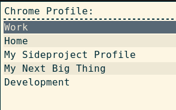
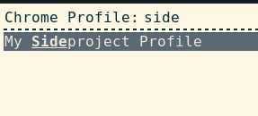

# rofi-chrome-profile-launcher

A Chrome profile launcher for [rofi](https://github.com/DaveDavenport/rofi).


**Note**: requires `bash` and `python`.

```sh
rofi -modi 'Chrome Profile':/path/to/rofi-chrome-profile-launcher.sh -show 'Chrome Profile'
```

## Usage

Start typing the name of the profile you want to open, then press Enter.

When you launch it:



When you start typing:



## Usage with i3wm


To use it [i3wm](https://i3wm.org) add this line to `.i3/config`.


```
bindsym Mod1+Shift+Control+o exec rofi -modi 'Chrome Profile':/path/to/rofi-chrome-profile-launcher/rofi-chrome-profile-launcher.sh -show 'Chrome Profile'
```


## Credits

Claudio d'Angelis <claudiodangelis@gmail.com>

MIT License (See [LICENSE](LICENSE))
